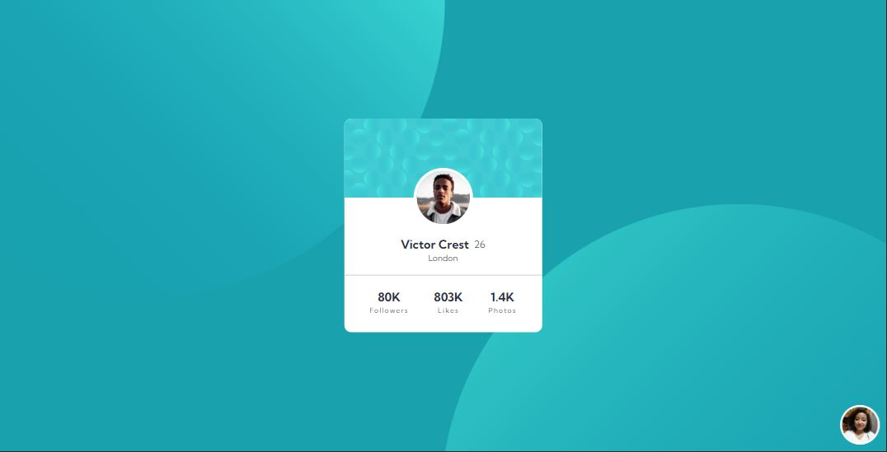

# Frontend Mentor - Profile card component solution

This is a solution to the [Profile card component challenge on Frontend Mentor](https://www.frontendmentor.io/challenges/profile-card-component-cfArpWshJ).

## Table of contents

- [Overview](#overview)
  - [The challenge](#the-challenge)
  - [Screenshot](#screenshot)
  - [Links](#links)
- [My process](#my-process)
  - [Built with](#built-with)
- [Author](#author)

## Overview

### The challenge

- Build out the project to the designs provided

### Screenshot

### Links

- Solution URL: [Github](https://github.com/DianaVCruz/profile-card-component-FM/)
- Live Site URL: [Netlify](https://profile-card-component-fronten-mentor.netlify.app/)

## My process

### Built with

- Semantic HTML5 markup
- CSS custom properties
- Flexbox
- CSS Grid
- Mobile-first workflow

## Author

- Website - [dianacruz.pro](https://dianacruz.pro)
- Frontend Mentor - [@DianaVCruz](https://www.frontendmentor.io/profile/DianaVCruz)
- Twitter - [@DianaCruzPro](https://www.twitter.com/DianaCruzPro)
